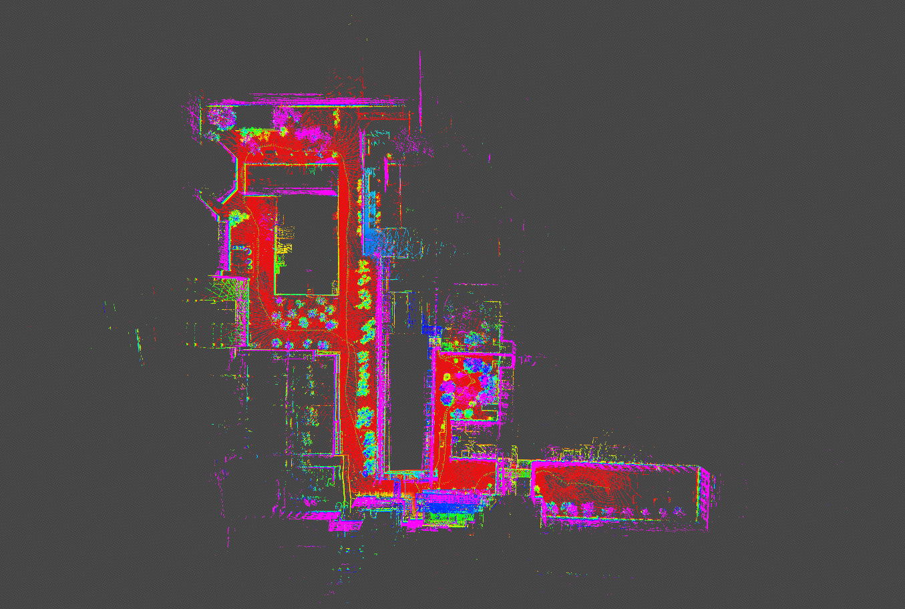

# IMU预积分

为dlo添加自己的预积分部分，后加以紧耦合，去畸变。

lio-sam walking dataset:

    

## finished
- [X] 使用优化器耦合imu和lidar的odom
    - [X] 添加到g2o的第一条边，补全函数
    - [X] 学习lio-sam单独开辟了用于优化的imu预积分。
    - [X] 添加了优化结果速度限制。
- [X] 解决imu的odom抖动问题，imu预积分效果不好。
    - [X] 在预积分reset部分添加了之前遗漏的参数。速度限制作用明显下降。
- [X] 适配livox雷达，要求有livox_ros_driver2的msg。若不使用则需要注释掉。
## TO DO
- [ ] 提升稳定性。
- [ ] 解决优化结果bg_, ba_都是0.0的问题。
- [ ] 点云去畸变。
    - [X] imu时间戳与雷达对齐,避免部分点云无法去畸变.
    - [X] 对齐时间戳后出现抖动，怀疑是由于修改了积分的时间段，将原本积分到header.stamp的修改到积分到最后一个点云点的时间戳，积分时间不变还是0.1s.为`imuPreintegration`函数加锁，有所缓解。
    - [ ] 缩短积分时间，有时积分耗时80ms。仅仅使用一个队列积分，避免对同一数据积分两次。

## Acknowledgement
[DLO & DLIO](https://github.com/vectr-ucla), [LIO-SAM](https://github.com/TixiaoShan/LIO-SAM)